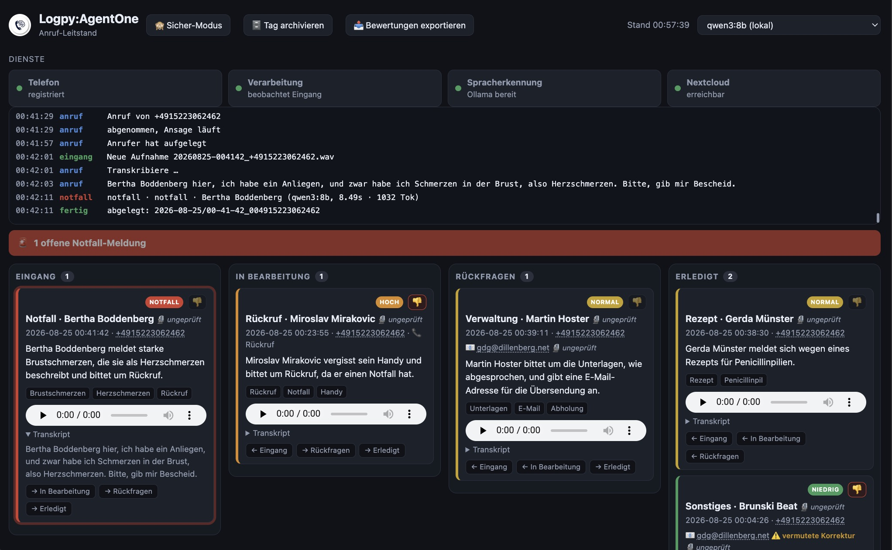

# Logpy:AgentOne

**v1.0.0** — siehe [CHANGELOG.md](CHANGELOG.md)

Praxis-Telefon-Agent — nimmt Anrufe (Sprachnachrichten) einer Hausarztpraxis entgegen, **transkribiert**
sie lokal, **kategorisiert** das Anliegen und **legt** das Ergebnis strukturiert
ab (lokal und optional in Nextcloud).

**Vollständig on-prem** — keine Patientendaten verlassen den Rechner.



> **Hinweis:** Alle Namen, Rufnummern und Anliegen in diesem Repository sind
> erfunden — auch im Screenshot und in der Beispielkonfiguration. „Praxis
> Musterhausen" ist ein Platzhalter. Echte Zugangsdaten und Anrufdaten liegen
> außerhalb des Repositorys (`.env`, `ablage/`, `telefon/`).

Wer das Projekt auf einem weiteren Rechner einrichtet: [docs/MITGABE.md](docs/MITGABE.md)
sammelt die Erfahrungswerte, die in dieser Anleitung nicht stehen.

## Stufen

1. **Die Pipe** (fertig): Audio → Transkript → Kategorie → Ablage.
2. **Telefonie** (steht): FreeSWITCH nimmt über den Plusnet-Trunk an, spielt die
   Ansage, nimmt auf und legt die Datei im Eingang der Pipe ab.
3. **Feinschliff** (teilweise): Löschfristen ✅, Notfall-Alarm ✅,
   Verschlüsselung at rest ✅ (Betreiber-Pflicht: FileVault, siehe
   [Datenschutz](#datenschutz-dsgvo)), Monitoring/Alerting bei Diensteausfall ✅
   (`pipe/monitor.py`, siehe unten).

## Bausteine

| Datei | Aufgabe |
|---|---|
| `pipe/transcribe.py` | Spracherkennung (whisper.cpp / faster-whisper), lokal |
| `pipe/categorize.py` | Kategorisierung via Ollama/Qwen, erzwungenes JSON-Schema |
| `pipe/store.py` | Ablage lokal + Nextcloud (WebDAV, steckbar) |
| `pipe/process_call.py` | Orchestrator / CLI |
| `pipe/config.py` | Konfiguration aus `.env` |
| `pipe/watch.py` | Beobachtet den Eingang und schiebt Aufnahmen durch die Pipe |
| `pipe/server.py` | Leitstand: Live-Ansicht mit Status, Anrufen und Verlauf |
| `pipe/dienste.py` | Zustand der beteiligten Dienste (Telefon, Verarbeitung, Spracherkennung, Nextcloud) — geteilt von Leitstand und Störungswache |
| `pipe/monitor.py` | Störungswache: alarmiert lokal (macOS-Benachrichtigung + Ton), wenn ein Dienst ausfällt |
| `pipe/alarm.py` | Verschickt den lokalen macOS-Alarm (osascript) |
| `pipe/protokoll.py` | Ereignisprotokoll (JSONL) für den Leitstand |
| `pipe/audit.py` | Unveränderliches Audit-Log (append-only, siehe unten) |
| `pipe/loeschen.py` | Löscht erledigte Anrufe nach Ablauf der Aufbewahrungsfrist |
| `pipe/bewertung.py` | 👍/👎-Bewertung pro Anruf (Leitstand) |
| `pipe/export.py` | Exportiert bewertete Anrufe als JSONL-Trainingsdaten |
| `prompts/categorize_de.txt` | Kategorisierungs-Prompt (deutsch, mehrsprachig-tauglich) |
| `telefon/` | Ansage, FreeSWITCH-Vorlagen, Start- und Einrichtungsskripte |

## Kategorien

`termin · rezept · ueberweisung · befund · verwaltung · beschwerden · notfall ·
rueckruf · sonstiges`
Dringlichkeit: `niedrig · normal · hoch · notfall`

## Einrichtung

Getestet auf macOS (Apple Silicon). Rechnen Sie mit ~10 GB für Modelle.

**1. Programme**

```bash
brew install ffmpeg whisper-cpp freeswitch
brew install ollama && ollama serve &      # oder Ollama.app starten
```

**2. Sprachmodell** — ordnet die Anliegen ein:

```bash
ollama pull qwen3:8b                       # ~5,2 GB, reines Textmodell (kein Vision-Ballast)
```

Auf Rechnern mit 16 GB Arbeitsspeicher passt kein größeres Modell daneben,
solange die Telefonie läuft.

**3. Spracherkennung** — whisper.cpp braucht ein ggml-Modell:

```bash
mkdir -p ~/whisper-models && cd ~/whisper-models
curl -LO https://huggingface.co/ggerganov/whisper.cpp/resolve/main/ggml-large-v3-turbo.bin
```

**4. Python-Pakete und Ansage-Stimme**

```bash
pip3 install -r requirements.txt
# Piper lädt seine Stimmen über HTTPS - ohne CA-Bundle schlägt das fehl:
export SSL_CERT_FILE=$(python3 -m certifi)
python3 -m piper.download_voices --download-dir ~/piper-voices \
        de_DE-thorsten_emotional-medium
```

**5. Konfiguration**

```bash
cp .env.example .env      # SIP-Zugang, Nextcloud, Leitstand-Passwort eintragen
./telefon/ansage_bauen.sh
./telefon/freeswitch/einrichten.sh
```

**6. Starten**

```bash
./telefon/starten.sh      # prüft die Voraussetzungen und startet alles
```

### Stolpersteine

- **FreeSWITCH liest aus dem Cellar.** `starten.sh` übergibt deshalb `-conf`
  auf `/opt/homebrew/etc/freeswitch`; sonst landen Trunk und Dialplan in einem
  Verzeichnis, das jedes Homebrew-Upgrade überschreibt.
- **Event-Socket-Port.** `fs_cli` erwartet 8021. Ist der belegt, in
  `autoload_configs/event_socket.conf.xml` einen freien Port eintragen und
  `FS_PORT` in `starten.sh` anpassen.
- **Rotierende Provider-Adressen.** Löst der SIP-Hostname auf mehrere IPs auf,
  bricht die Registrierung ständig ab: die Anmeldung landet auf einem anderen
  Server als die Anfrage. `SIP_PROXY` auf einen Host setzen, der auf genau eine
  IP zeigt.
- **Der Leitstand im Netz** verlangt `LEITSTAND_PASS`, sonst startet er nicht.

## Nutzung

```bash
cp .env.example .env        # bei Bedarf anpassen
python3 -m pipe.process_call test/rezept.wav --nummer 021031234567
```

Ergebnis unter `ablage/JJJJ-MM-TT/HH-MM-SS_<nummer>/`:
- `meta.json` — strukturierte Felder (maschinenlesbar)
- `zusammenfassung.md` — für Menschen
- `aufnahme.<ext>` — Audiokopie

## Telefonie (Stufe 2)

FreeSWITCH registriert sich mit dem SIP-Konto der Praxis beim Provider, nimmt
eingehende Anrufe an, spielt die Ansage und nimmt auf. Die Aufnahme landet unter
`telefon/eingang/JJJJMMTT-HHMMSS_<nummer>.wav`; `pipe.watch` erkennt sie, schiebt
sie durch die Pipe und räumt sie nach `telefon/verarbeitet/` weg.

```bash
./telefon/ansage_bauen.sh              # Ansage aus telefon/ansage.txt erzeugen
./telefon/freeswitch/einrichten.sh     # Trunk + Dialplan in FreeSWITCH eintragen
./telefon/starten.sh                   # startet FreeSWITCH, Verarbeitung, Leitstand
```

Danach läuft der **Leitstand** unter <http://127.0.0.1:8088> — das Arbeitsbrett
der Praxis, unabhängig von Nextcloud:

- Ampeln für Telefon, Verarbeitung, Spracherkennung und Nextcloud
- die Anrufe als Board mit den Spalten `Eingang · In Bearbeitung · Rückfragen ·
  Erledigt`, verschiebbar per Ziehen oder über die Knöpfe auf der Karte
- je Karte Kategorie, Anrufer, Dringlichkeit als Farbe, Anliegen, Stichworte,
  Abspielknopf für die Aufnahme und das Transkript zum Aufklappen
- die Rufnummer ist anklickbar (`tel:`) und startet den Rückruf in der
  Telefon-App des Rechners; liegt die Karte noch im Eingang, wandert sie dabei
  nach `In Bearbeitung`
- darunter der laufende Verlauf — vom Klingeln über die Erkennung bis zur Ablage
- **Sicher-Modus** (🙈-Knopf oben links): blurrt die Rufnummern auf allen
  Karten, für Screenshots/Bildschirmaufnahmen. Merkt sich den Zustand pro
  Browser (`localStorage`), übersteht also einen Reload.
- **Notfall-Alarm:** liegt eine Karte mit Dringlichkeit `notfall` nicht im
  letzten Stapel (`Erledigt`), pulsiert ihr Rahmen, ein rotes Banner erscheint
  und alle 60s ertönt ein Doppel-Piepton (Web Audio API, keine Datei nötig) —
  bis die Karte nach `Erledigt` verschoben wird. Browser blocken Autoplay-Audio
  ohne vorherige Interaktion: ein Klick irgendwo auf die Seite schaltet den Ton
  frei.
- **Notfall-Sicherheitsnetz** (`categorize.py`): bei der Notfall-Erkennung
  verlässt sich das System nicht allein auf das LLM — ein deterministischer
  Check gegen die im Prompt selbst genannten Symptome (Atemnot, Brustschmerz,
  Bewusstlosigkeit, starke Blutung) eskaliert nötigenfalls hart im Code auf
  `notfall`, unabhängig vom Modell. Grund: `qwen3:8b` stufte „starke
  Brustschmerzen … kriege kaum Luft" reproduzierbar (3/3 Testläufe) nur als
  „hoch" ein, obwohl es die Symptome selbst als Stichworte erkannte. Eskaliert
  nur nach oben, nie nach unten.

Standardmäßig hört der Leitstand nur auf `127.0.0.1`. Soll er von anderen
Rechnern der Praxis erreichbar sein, `LEITSTAND_HOST=0.0.0.0` setzen — dann ist
`LEITSTAND_PASS` Pflicht, sonst startet er nicht: die Seiten zeigen Transkripte
und Aufnahmen von Patienten, das darf nicht offen im Netz stehen. Der Schutz
gilt auch für die Schnittstellen und die Audiodateien.

> **Wichtig zu `0.0.0.0`:** das bindet auf *alle* Netzwerk-Interfaces des
> Rechners — nicht nur auf ein VPN/Tailscale. Läuft der Rechner zusätzlich in
> einem normalen WLAN/LAN, ist der Leitstand (passwortgeschützt) auch dort
> erreichbar, nicht nur im VPN. Wer das nicht will, bindet gezielt auf die
> VPN-IP statt auf `0.0.0.0` (z. B. `LEITSTAND_HOST=100.x.x.x` bei Tailscale)
> oder blockt den Port per Firewall-Regel für alle anderen Interfaces.

Die Seite aktualisiert sich alle drei Sekunden; während man eine Karte zieht,
pausiert das. Der Bearbeitungsstand liegt als `stapel.json` im jeweiligen
Anrufordner, also lokal — die Übertragung nach Nextcloud-Deck kommt später.

Der SIP-Zugang steht in der `.env` (`SIP_USER`, `SIP_DOMAIN`, `SIP_PASS`). Das
Einrichtungsskript trägt das Passwort in die FreeSWITCH-Konfiguration ein und
setzt deren Rechte auf 600 — im Git liegen nur Vorlagen mit Platzhaltern.

Text ändern: `telefon/ansage.txt` bearbeiten, `ansage_bauen.sh` erneut
ausführen. Für den Praxisbetrieb muss die Ansage den Notruf 112 nennen und auf
die Aufzeichnung hinweisen, bevor der Signalton kommt — beides ist bei einer
Arztpraxis Pflicht, siehe „Offener Punkt" unter Datenschutz weiter unten.

Gesprochen wird lokal, wahlweise mit **Piper** (natürlicher, Modelle unter
`~/piper-voices`) oder dem macOS-`say` als Rückfall. Die Stimme
`de_DE-thorsten_emotional-medium` kennt acht Sprechweisen, wählbar über
`ANSAGE_EMOTION`: 0 amused · 1 angry · 2 disgusted · 3 drunk · 4 neutral ·
5 sleepy · 6 surprised · 7 whisper.

## Nextcloud aktivieren

`NEXTCLOUD_URL`, `NEXTCLOUD_USER`, `NEXTCLOUD_PASS` in `.env` setzen
(App-Passwort, **nicht** das Login-Passwort). Dann lädt jeder Anruf zusätzlich
nach `NEXTCLOUD_ORDNER/JJJJ-MM-TT/…`. Fehlt die Konfiguration, bleibt alles lokal.

## Deck-Board

Einschalten mit `NEXTCLOUD_DECK=1` in der `.env` — ohne diesen Schalter legt die
Pipe kein Board an, auch wenn `DECK_STAPEL` und `DECK_TEILEN` gesetzt sind.

Jeder Anruf bekommt eine Karte auf dem Board `Anrufe`. Die Stapel bilden den
Arbeitsablauf ab — `Eingang · In Bearbeitung · Rückfragen · Erledigt`, anpassbar
über `DECK_STAPEL`. Neue Anrufe landen immer im ersten Stapel; die Praxis zieht
sie weiter. Kategorie und Anrufer stehen im Kartentitel
(`17:52 · Rezept · Klaus Allofs`), die Dringlichkeit als farbiges Label. Das Board gehört dem Konto, mit dem die
Pipe arbeitet — ohne Freigabe legt sie zwar Karten an, die Praxis sieht aber ein
leeres Deck. Deshalb `DECK_TEILEN` in der `.env` auf die Nextcloud-Nutzer setzen
(kommagetrennt), die es sehen sollen; die Freigabe wird bei jedem Anruf
sichergestellt.

## Aufbewahrungsfrist & Audit-Log

`LOESCHFRIST_TAGE` in der `.env` (0 = aus) legt fest, nach wie vielen Tagen ein
**erledigter** Anruf (Aufnahme + Transkript, kompletter Ordner) gelöscht wird —
lokal und, falls hochgeladen, auch bei Nextcloud. Nur Anrufe im letzten Stapel
(`Erledigt`) werden angefasst; alles andere bleibt unangetastet, egal wie alt —
niemand soll einen liegen gebliebenen Anruf verlieren, bevor ihn jemand
gesehen hat.

Kein Cron/launchd nötig: `pipe.watch` (läuft ohnehin dauerhaft, siehe
`telefon/starten.sh`) prüft das alle 24h selbst mit. Manueller Aufruf für Tests:

```bash
python3 -m pipe.loeschen --pruefen    # nur anzeigen, was fällig wäre
python3 -m pipe.loeschen              # tatsächlich löschen
```

Jede Löschung (und jedes andere Pipe-Ereignis) landet zusätzlich unveränderlich
in `telefon/audit.log` — anders als `verlauf.log` (fürs Leitstand-UI, wird auf
2000 Zeilen gekürzt) wird diese Datei nie überschrieben, nur angehängt, und
zusätzlich per macOS `chflags uappnd` gegen nachträgliches Ändern/Kürzen
abgesichert (auch der eigene Prozess kommt danach nur noch per Anhängen rein).

## Störungswache (Monitoring/Alerting)

Die Dienste-Ampel im Leitstand (Telefon, Verarbeitung, Spracherkennung,
Nextcloud) zeigt den Zustand nur an, wenn gerade jemand die Seite offen hat.
`pipe/monitor.py` läuft deshalb als **eigener Prozess** (von
`telefon/starten.sh` mitgestartet, Log `telefon/monitor.log`), fragt dieselbe
Ampel (`pipe/dienste.py`) alle `MONITOR_TAKT_S` Sekunden (Default 60) ab und
alarmiert bei einer echten Störung (`schlecht`/`aus` — nicht bei `unklar`,
z. B. Nextcloud unkonfiguriert) lokal per macOS-Systembenachrichtigung + Ton
(`pipe/alarm.py`, `osascript`). Solange die Störung anhält, wird alle
`MONITOR_WIEDERHOLUNG_MIN` Minuten (Default 15) erneut erinnert; bei
Wiederherstellung einmalig „wieder ok".

Bewusst ein eigener, dritter Prozess statt in `pipe.watch` oder `pipe.server`
eingebaut: fällt einer der beiden aus, kann die Wache das trotzdem noch
melden. Wirkt nur lokal auf diesem Mac — für Alarme aufs Handy (z. B. per
Push/E-Mail) `pipe/alarm.py` erweitern.

```bash
python3 -m pipe.monitor            # dauerhaft beobachten (normalerweise per starten.sh)
python3 -m pipe.monitor --einmal   # einmal prüfen, für Tests
```

## Bewertung & Trainingsdaten-Export

Jede Karte im Leitstand hat 👍/👎 — war die Kategorisierung richtig? Bei 👎
optional die richtige Kategorie/Dringlichkeit dazu angeben. Landet als
`bewertung.json` im jeweiligen Anruf-Ordner.

„📤 Bewertungen exportieren" (oder automatisch beim „Tag archivieren")
schreibt alle aktuell bewerteten Anrufe als JSONL nach `training/` — ein
Datensatz pro Anruf mit Transkript, Modell-Ausgabe, verwendetem
Backend/Modell, Bewertung und ggf. Korrektur. Gedacht für externe Auswertung
(z. B. um Kategorisierungs-Fehler systematisch zu finden statt zufällig,
siehe das Notfall-Sicherheitsnetz oben). Der Export-Knopf verlangt eine
Bestätigung, weil dabei Transkripte und Namen den Rechner verlassen — bewusst
kein stiller Automatismus. `training/` ist gitignored.

## Datenschutz (DSGVO)

Gesundheitsdaten — Pflichten für den Produktivbetrieb (Stufe 2):
- Aufnahme-Ansage am Gesprächsanfang.
- Notfall-Ansage zuerst (112 / 116117); der Agent gibt **keine** medizinischen Ratschläge.
- Verschlüsselung at rest, Zugriffskontrolle.
- Löschfristen — siehe oben (`LOESCHFRIST_TAGE`).
- Verarbeitung lokal (Whisper + Qwen) — kein Cloud-Dienst im Datenpfad.

> **Offener Punkt:** Die aktuelle `telefon/ansage.txt` erfüllt die ersten
> beiden Punkte noch nicht (kein Notfall-Hinweis, keine Aufnahme-Einwilligung)
> — Text anpassen und `ansage_bauen.sh` neu laufen lassen, bevor die Anlage im
> echten Praxisbetrieb ans Netz geht.

> **Verschlüsselung at rest — Pflicht des Betreibers:** Die Pipe legt
> Aufnahmen, Transkripte und Metadaten (`ablage/`, `telefon/`, `training/`)
> unverschlüsselt auf der Platte ab und verlässt sich auf
> Festplattenverschlüsselung durch das Betriebssystem. **FileVault muss auf
> jedem Rechner aktiviert sein, der diese Pipe betreibt**
> (Systemeinstellungen → Datenschutz & Sicherheit → FileVault, oder
> `sudo fdesetup enable`) — den Recovery-Key sicher verwahren (Passwort-
> Tresor), da er das einzige Mittel bei vergessenem Login-Passwort ist.
> Ist FileVault auf einem Zielsystem nicht aktivierbar oder nicht zulässig
> (z. B. Mehrbenutzer-Rechner, andere Auflagen), reicht das nicht aus — dann
> braucht die App eine eigene Verschlüsselung der Ablage, die es aktuell
> **nicht** gibt. Das Aktivieren/Prüfen von FileVault ist Aufgabe des
> Betreibers vor Ort, nicht Teil dieses Repos.
