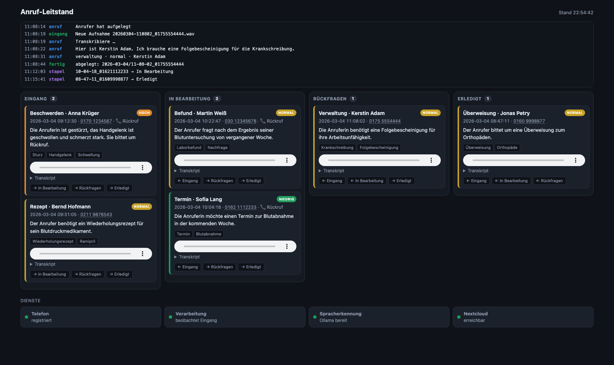

# Praxis-Telefon-Agent

Nimmt Anrufe (Sprachnachrichten) einer Hausarztpraxis entgegen, **transkribiert**
sie lokal, **kategorisiert** das Anliegen und **legt** das Ergebnis strukturiert
ab (lokal und optional in Nextcloud).

**Vollständig on-prem** — keine Patientendaten verlassen den Rechner.



> **Hinweis:** Alle Namen, Rufnummern und Anliegen in diesem Repository sind
> erfunden — auch im Screenshot und in der Beispielkonfiguration. „Praxis
> Musterhausen" ist ein Platzhalter. Echte Zugangsdaten und Anrufdaten liegen
> außerhalb des Repositorys (`.env`, `ablage/`, `telefon/`).

Wer das Projekt auf einem weiteren Rechner einrichtet: [docs/MITGABE.md](docs/MITGABE.md)
sammelt die Erfahrungswerte, die in dieser Anleitung nicht stehen.

## Stufen

1. **Die Pipe** (fertig): Audio → Transkript → Kategorie → Ablage.
2. **Telefonie** (steht): FreeSWITCH nimmt über den Plusnet-Trunk an, spielt die
   Ansage, nimmt auf und legt die Datei im Eingang der Pipe ab.
3. **Feinschliff** (offen): Löschfristen, Notfall-Alarm, Monitoring.

## Bausteine

| Datei | Aufgabe |
|---|---|
| `pipe/transcribe.py` | Spracherkennung (whisper.cpp / faster-whisper), lokal |
| `pipe/categorize.py` | Kategorisierung via Ollama/Qwen, erzwungenes JSON-Schema |
| `pipe/store.py` | Ablage lokal + Nextcloud (WebDAV, steckbar) |
| `pipe/process_call.py` | Orchestrator / CLI |
| `pipe/config.py` | Konfiguration aus `.env` |
| `pipe/watch.py` | Beobachtet den Eingang und schiebt Aufnahmen durch die Pipe |
| `pipe/server.py` | Leitstand: Live-Ansicht mit Status, Anrufen und Verlauf |
| `pipe/protokoll.py` | Ereignisprotokoll (JSONL) für den Leitstand |
| `prompts/categorize_de.txt` | Kategorisierungs-Prompt (deutsch, mehrsprachig-tauglich) |
| `telefon/` | Ansage, FreeSWITCH-Vorlagen, Start- und Einrichtungsskripte |

## Kategorien

`termin · rezept · ueberweisung · befund · verwaltung · beschwerden · notfall ·
rueckruf · sonstiges`
Dringlichkeit: `niedrig · normal · hoch · notfall`

## Einrichtung

Getestet auf macOS (Apple Silicon). Rechnen Sie mit ~10 GB für Modelle.

**1. Programme**

```bash
brew install ffmpeg whisper-cpp freeswitch
brew install ollama && ollama serve &      # oder Ollama.app starten
```

**2. Sprachmodell** — ordnet die Anliegen ein:

```bash
ollama pull qwen3.5:latest                 # ~6,6 GB
```

Auf Rechnern mit 16 GB Arbeitsspeicher passt kein größeres Modell daneben,
solange die Telefonie läuft.

**3. Spracherkennung** — whisper.cpp braucht ein ggml-Modell:

```bash
mkdir -p ~/whisper-models && cd ~/whisper-models
curl -LO https://huggingface.co/ggerganov/whisper.cpp/resolve/main/ggml-large-v3-turbo.bin
```

**4. Python-Pakete und Ansage-Stimme**

```bash
pip3 install -r requirements.txt
# Piper lädt seine Stimmen über HTTPS - ohne CA-Bundle schlägt das fehl:
export SSL_CERT_FILE=$(python3 -m certifi)
python3 -m piper.download_voices --download-dir ~/piper-voices \
        de_DE-thorsten_emotional-medium
```

**5. Konfiguration**

```bash
cp .env.example .env      # SIP-Zugang, Nextcloud, Leitstand-Passwort eintragen
./telefon/ansage_bauen.sh
./telefon/freeswitch/einrichten.sh
```

**6. Starten**

```bash
./telefon/starten.sh      # prüft die Voraussetzungen und startet alles
```

### Stolpersteine

- **FreeSWITCH liest aus dem Cellar.** `starten.sh` übergibt deshalb `-conf`
  auf `/opt/homebrew/etc/freeswitch`; sonst landen Trunk und Dialplan in einem
  Verzeichnis, das jedes Homebrew-Upgrade überschreibt.
- **Event-Socket-Port.** `fs_cli` erwartet 8021. Ist der belegt, in
  `autoload_configs/event_socket.conf.xml` einen freien Port eintragen und
  `FS_PORT` in `starten.sh` anpassen.
- **Rotierende Provider-Adressen.** Löst der SIP-Hostname auf mehrere IPs auf,
  bricht die Registrierung ständig ab: die Anmeldung landet auf einem anderen
  Server als die Anfrage. `SIP_PROXY` auf einen Host setzen, der auf genau eine
  IP zeigt.
- **Der Leitstand im Netz** verlangt `LEITSTAND_PASS`, sonst startet er nicht.

## Nutzung

```bash
cp .env.example .env        # bei Bedarf anpassen
python3 -m pipe.process_call test/rezept.wav --nummer 021031234567
```

Ergebnis unter `ablage/JJJJ-MM-TT/HH-MM-SS_<nummer>/`:
- `meta.json` — strukturierte Felder (maschinenlesbar)
- `zusammenfassung.md` — für Menschen
- `aufnahme.<ext>` — Audiokopie

## Telefonie (Stufe 2)

FreeSWITCH registriert sich mit dem SIP-Konto der Praxis beim Provider, nimmt
eingehende Anrufe an, spielt die Ansage und nimmt auf. Die Aufnahme landet unter
`telefon/eingang/JJJJMMTT-HHMMSS_<nummer>.wav`; `pipe.watch` erkennt sie, schiebt
sie durch die Pipe und räumt sie nach `telefon/verarbeitet/` weg.

```bash
./telefon/ansage_bauen.sh              # Ansage aus telefon/ansage.txt erzeugen
./telefon/freeswitch/einrichten.sh     # Trunk + Dialplan in FreeSWITCH eintragen
./telefon/starten.sh                   # startet FreeSWITCH, Verarbeitung, Leitstand
```

Danach läuft der **Leitstand** unter <http://127.0.0.1:8088> — das Arbeitsbrett
der Praxis, unabhängig von Nextcloud:

- Ampeln für Telefon, Verarbeitung, Spracherkennung und Nextcloud
- die Anrufe als Board mit den Spalten `Eingang · In Bearbeitung · Rückfragen ·
  Erledigt`, verschiebbar per Ziehen oder über die Knöpfe auf der Karte
- je Karte Kategorie, Anrufer, Dringlichkeit als Farbe, Anliegen, Stichworte,
  Abspielknopf für die Aufnahme und das Transkript zum Aufklappen
- die Rufnummer ist anklickbar (`tel:`) und startet den Rückruf in der
  Telefon-App des Rechners; liegt die Karte noch im Eingang, wandert sie dabei
  nach `In Bearbeitung`
- darunter der laufende Verlauf — vom Klingeln über die Erkennung bis zur Ablage

Standardmäßig hört der Leitstand nur auf `127.0.0.1`. Soll er von anderen
Rechnern der Praxis erreichbar sein, `LEITSTAND_HOST=0.0.0.0` setzen — dann ist
`LEITSTAND_PASS` Pflicht, sonst startet er nicht: die Seiten zeigen Transkripte
und Aufnahmen von Patienten, das darf nicht offen im Netz stehen. Der Schutz
gilt auch für die Schnittstellen und die Audiodateien.

Die Seite aktualisiert sich alle drei Sekunden; während man eine Karte zieht,
pausiert das. Der Bearbeitungsstand liegt als `stapel.json` im jeweiligen
Anrufordner, also lokal — die Übertragung nach Nextcloud-Deck kommt später.

Der SIP-Zugang steht in der `.env` (`SIP_USER`, `SIP_DOMAIN`, `SIP_PASS`). Das
Einrichtungsskript trägt das Passwort in die FreeSWITCH-Konfiguration ein und
setzt deren Rechte auf 600 — im Git liegen nur Vorlagen mit Platzhaltern.

Die Ansage nennt den Notruf 112 und weist auf die Aufzeichnung hin, bevor der
Signalton kommt — beides ist bei einer Arztpraxis Pflicht. Text ändern:
`telefon/ansage.txt` bearbeiten, `ansage_bauen.sh` erneut ausführen.

Gesprochen wird lokal, wahlweise mit **Piper** (natürlicher, Modelle unter
`~/piper-voices`) oder dem macOS-`say` als Rückfall. Die Stimme
`de_DE-thorsten_emotional-medium` kennt acht Sprechweisen, wählbar über
`ANSAGE_EMOTION`: 0 amused · 1 angry · 2 disgusted · 3 drunk · 4 neutral ·
5 sleepy · 6 surprised · 7 whisper.

## Nextcloud aktivieren

`NEXTCLOUD_URL`, `NEXTCLOUD_USER`, `NEXTCLOUD_PASS` in `.env` setzen
(App-Passwort, **nicht** das Login-Passwort). Dann lädt jeder Anruf zusätzlich
nach `NEXTCLOUD_ORDNER/JJJJ-MM-TT/…`. Fehlt die Konfiguration, bleibt alles lokal.

## Deck-Board

Einschalten mit `NEXTCLOUD_DECK=1` in der `.env` — ohne diesen Schalter legt die
Pipe kein Board an, auch wenn `DECK_STAPEL` und `DECK_TEILEN` gesetzt sind.

Jeder Anruf bekommt eine Karte auf dem Board `Anrufe`. Die Stapel bilden den
Arbeitsablauf ab — `Eingang · In Bearbeitung · Rückfragen · Erledigt`, anpassbar
über `DECK_STAPEL`. Neue Anrufe landen immer im ersten Stapel; die Praxis zieht
sie weiter. Kategorie und Anrufer stehen im Kartentitel
(`17:52 · Rezept · Klaus Allofs`), die Dringlichkeit als farbiges Label. Das Board gehört dem Konto, mit dem die
Pipe arbeitet — ohne Freigabe legt sie zwar Karten an, die Praxis sieht aber ein
leeres Deck. Deshalb `DECK_TEILEN` in der `.env` auf die Nextcloud-Nutzer setzen
(kommagetrennt), die es sehen sollen; die Freigabe wird bei jedem Anruf
sichergestellt.

## Datenschutz (DSGVO)

Gesundheitsdaten — Pflichten für den Produktivbetrieb (Stufe 2):
- Aufnahme-Ansage am Gesprächsanfang.
- Notfall-Ansage zuerst (112 / 116117); der Agent gibt **keine** medizinischen Ratschläge.
- Verschlüsselung at rest, Zugriffskontrolle, Löschfristen.
- Verarbeitung lokal (Whisper + Qwen) — kein Cloud-Dienst im Datenpfad.
